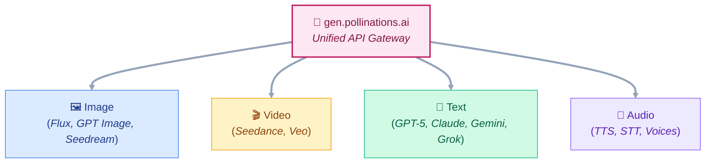

<div align="center">
  
  
  <h3>Open-source AI for people who make things.</h3>
  
  <p>A community-driven platform where developers, artists, and tinkerers build together.<br/>No gatekeeping — just good tools and good people.</p>

[](https://github.com/pollinations/pollinations)
[](https://github.com/pollinations/pollinations/blob/main/LICENSE)
[](https://discord.gg/pollinations-ai-885844321461485618)
[](https://www.npmjs.com/package/@pollinations/react)


[Website](https://pollinations.ai) · [Dashboard](https://enter.pollinations.ai) · [API Docs](https://github.com/pollinations/pollinations/blob/main/APIDOCS.md) · [Discord](https://discord.gg/pollinations-ai-885844321461485618)

</div>

---

## 🚀 Quick Start

> Get your API key at [enter.pollinations.ai](https://enter.pollinations.ai)

```bash
# Generate an image
curl 'https://gen.pollinations.ai/image/a%20cat?key=YOUR_API_KEY' -o image.jpg

# Generate text
curl 'https://gen.pollinations.ai/text/Hello?key=YOUR_API_KEY'

# OpenAI-compatible endpoint
curl 'https://gen.pollinations.ai/v1/chat/completions' \
  -H 'Authorization: Bearer YOUR_API_KEY' \
  -H 'Content-Type: application/json' \
  -d '{"model": "openai", "messages": [{"role": "user", "content": "Hello"}]}'
```

## ✨ What We Offer

| Feature                 | Description                                        |
| ----------------------- | -------------------------------------------------- |
| 🖼️ **Image Generation** | Flux, GPT Image, Seedream, Kontext, and more       |
| 🎬 **Video Generation** | Seedance, Veo — text-to-video (alpha)              |
| 💬 **Text Generation**  | GPT-5, Claude, Gemini, DeepSeek, Grok, Perplexity  |
| 🎵 **Audio**            | Text-to-speech with multiple voices                |
| 🌱 **Pollen Tiers**     | Earn daily credits by contributing — tiers in beta |
| 🤖 **MCP Server**       | AI assistants like Claude can generate directly    |
| 💯 **100% Open Source** | Code, roadmap, conversations — all public          |

## 📊 Community Stats

<!-- STATS:START -->

| Metric           | Count                                                                                                          |
| ---------------- | -------------------------------------------------------------------------------------------------------------- |
| ⭐ Stars         |                |
| 🍴 Forks         |                |
| 👥 Contributors  |  |
| 🔄 Open PRs      |              |
| 📦 npm Downloads |                              |

<!-- STATS:END -->

## 📦 Ecosystem

### Core Platform

- **[pollinations](https://github.com/pollinations/pollinations)** — Main repo: API backends, web frontend, React hooks, MCP server

### Integrations

- **[@pollinations/react](https://www.npmjs.com/package/@pollinations/react)** — React hooks for easy frontend integration
- **[@pollinations/model-context-protocol](https://www.npmjs.com/package/@pollinations/model-context-protocol)** — MCP server for AI assistants

## 🏗️ Architecture



## 🤝 Get Involved

- 💬 **[Discord](https://discord.gg/pollinations-ai-885844321461485618)** — Chat with the community
- 🐛 **[Issues](https://github.com/pollinations/pollinations/issues)** — Report bugs or request features
- 📱 **[Submit Your App](https://github.com/pollinations/pollinations/issues/new?template=tier-app-submission.yml)** — Share what you've built

## 💚 Support Us

- ☕ **[Ko-fi](https://ko-fi.com/pollinationsai)** — One-time donations
- 💖 **[GitHub Sponsors](https://github.com/sponsors/pollinations)** — Monthly support
- 🌐 **[Open Collective](https://opencollective.com/pollinationsai)** — Transparent funding

## 📣 Stay Connected

<p align="center">
  <a href="https://twitter.com/pollinations_ai">𝕏 Twitter</a> · 
  <a href="https://instagram.com/pollinations_ai">Instagram</a> · 
  <a href="https://www.linkedin.com/company/pollinations-ai">LinkedIn</a> · 
  <a href="https://facebook.com/pollinations">Facebook</a> · 
  <a href="https://www.reddit.com/r/pollinations_ai/">Reddit</a> · 
  <a href="https://www.youtube.com/c/pollinations">YouTube</a>
</p>

## 🌍 Supported By

<p align="center">
  <a href="https://www.perplexity.ai/">Perplexity AI</a> · 
  <a href="https://aws.amazon.com/">AWS</a> · 
  <a href="https://io.net/">io.net</a> · 
  <a href="https://www.byteplus.com/">BytePlus</a> · 
  <a href="https://cloud.google.com/">Google Cloud</a> · 
  <a href="https://www.nvidia.com/en-us/deep-learning-ai/startups/">NVIDIA Inception</a> · 
  <a href="https://azure.microsoft.com/">Azure</a> · 
  <a href="https://www.cloudflare.com/">Cloudflare</a> · 
  <a href="https://www.scaleway.com/">Scaleway</a> · 
  <a href="https://modal.com/">Modal</a> · 
  <a href="https://api.navy/">NavyAI</a> · 
  <a href="https://nebius.com/">Nebius</a>
</p>

---

<div align="center">
  <sub>Made with ❤️ in Berlin · <a href="https://github.com/pollinations/pollinations/blob/main/LICENSE">MIT License</a></sub>
</div>
